# Movies-EDA
Looking at a data set containing meta data on 45,000 movies.

The data set can be found at: https://www.kaggle.com/rounakbanik/the-movies-dataset

I also have a notebook on Kaggle where most of the charts are interactive here: https://www.kaggle.com/jbofill/eda-and-clustering

I could not upload all the files directly due to some being too big. I have included some of the smaller csvs in the repository for a sample of what the data looks like though.

Due to the columns of the data set not being detailed, it is difficult to assume what each of the columns mean. The EDA won't be as in depth as others.

# EDA

## Relation between Budget and Revenue
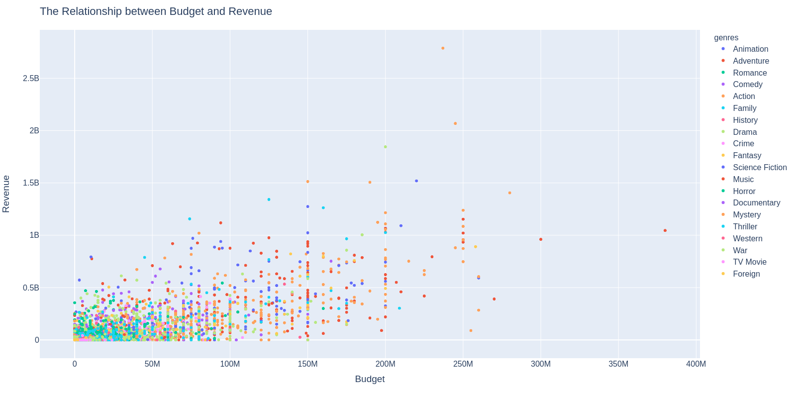
Pretty interesting to see that theres almost somewhat of a linear trend with Budget and Revenue

## Genres with the largest Budgets
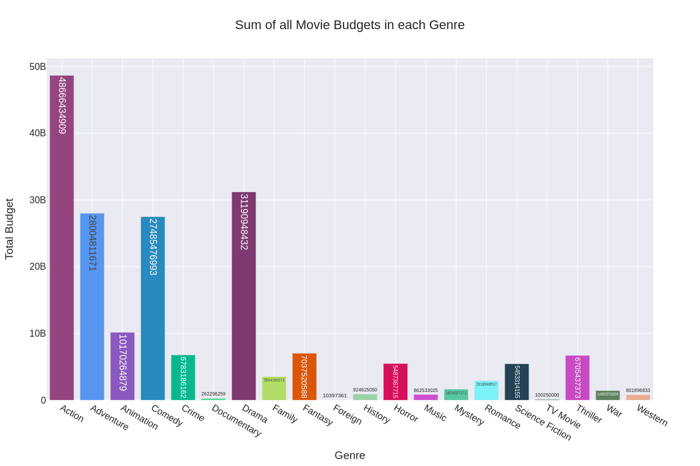
I was surprised see that Drama was second. I not much of a drama movie kind of guy I guess. 

## Relationship between Budget and Runtime
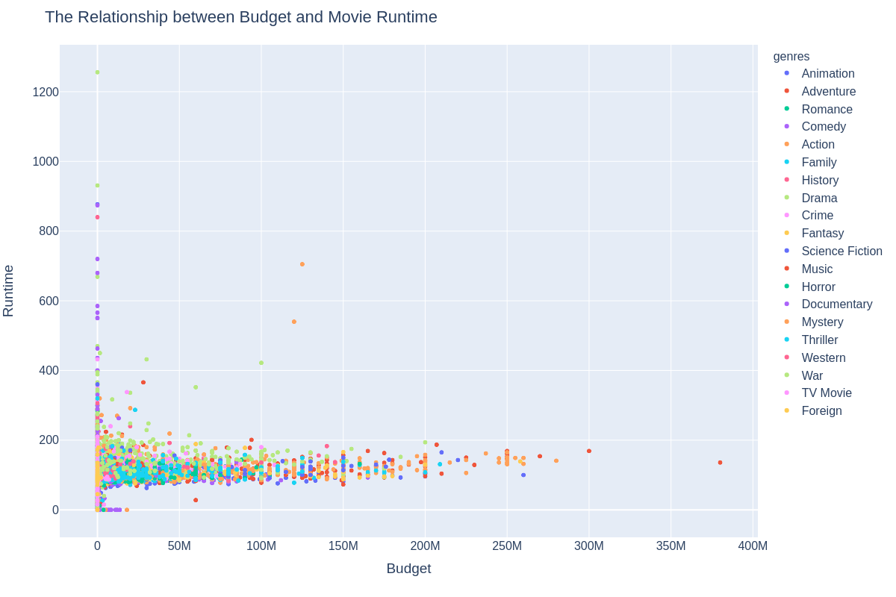
It's interesting that budget doesn't really seem to affect the runtime of a movie that much. I would've thought that it would since a longer movie means more editing etc.

## Relationship between Revenue and Runtime
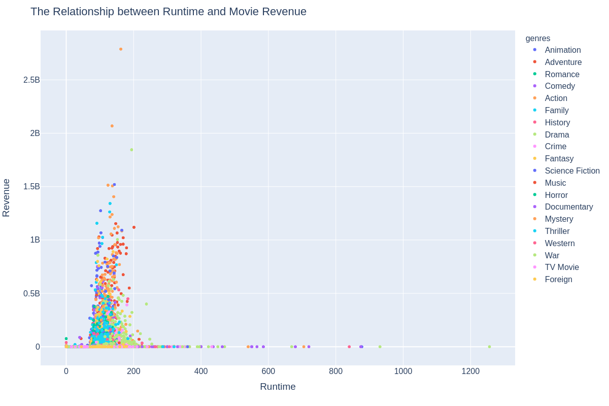
A few things to note from this scatter plot:
- There is a movie runtime sweet-spot 0 to ~200 minutes. Makes sense because no one wants to watch a 900 minute movie
- Each movie genre almost has a tight clustering of revenue and runtime. Family movies are a good example of this
- Drama movies tend to be longer, which is interesting

# Clustering
One feature that I have not looked at yet that could pose some implications in clustering is the vote_count label.

## Vote Count Data Distribution
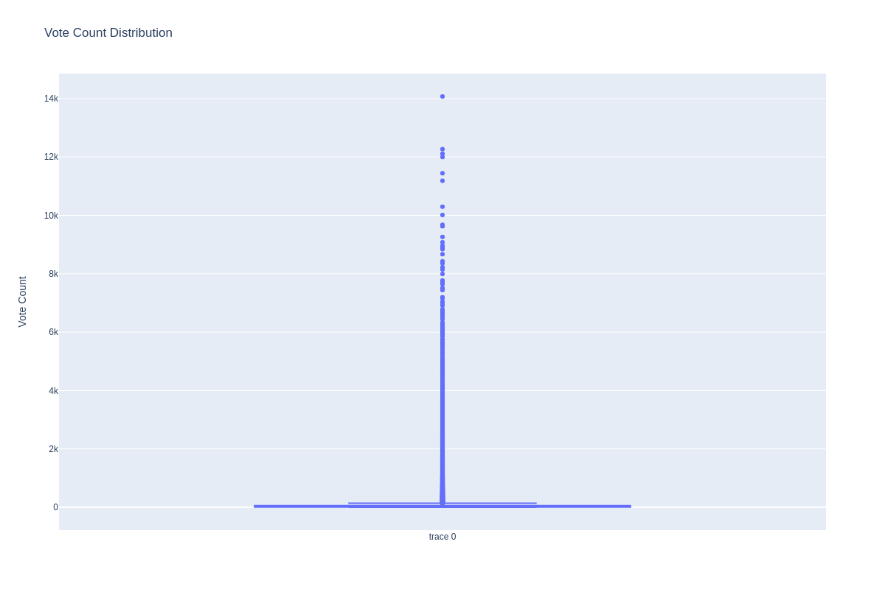
It seems that a majority has a vote count that is not substantial. I am talking about votes under 15.  
  
So I am thinking of removing everything before the 3rd quartile.  
Here is the new distribution  
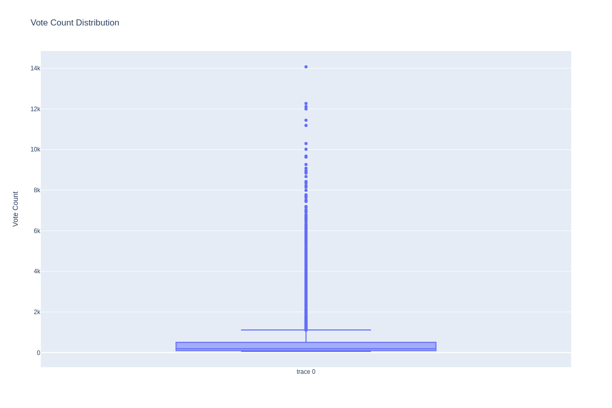 
This looks considerably better and will help us understand our clustering results better.

## KMeans Clustering

Vote Count alone shows that the data is not perfectly distributed. Due to this, I plan to use a MinMax Scaler to preprocess my data.  
  
I now need to run a custom Grid Search to find the optimal K for the KMeans algorithm. I will try Ks 1 through 30 and see which K gives me the best score using the Elbow Method.

### Elbow Method
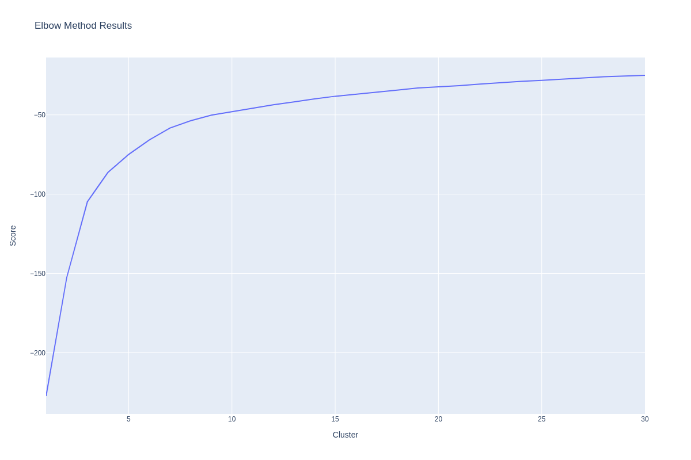 
Since these are plotly graphs, I am able to zoom in and look and trends more closely. Look at my Kaggle notebook to interact with the graphs.  
I decided that clusters of 9 seems to have the best elbow. I could go for a cluster like 19 (you can see it a little), but 9 is easier to work with/

### Cluster Analysis
Here are the individual records from the data frame grouped up with their clusters
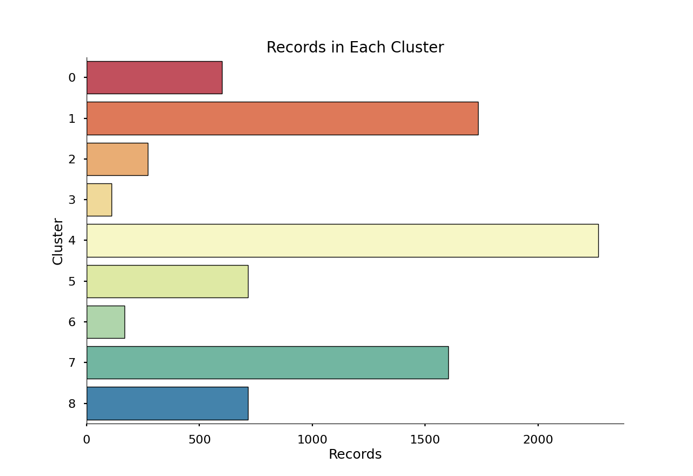  
Cluster 0,2 and 6 has a cardinality considerably larger than the rest

#### Feature Matrix
Looking how each of the features compare to each other with each cluster being colored
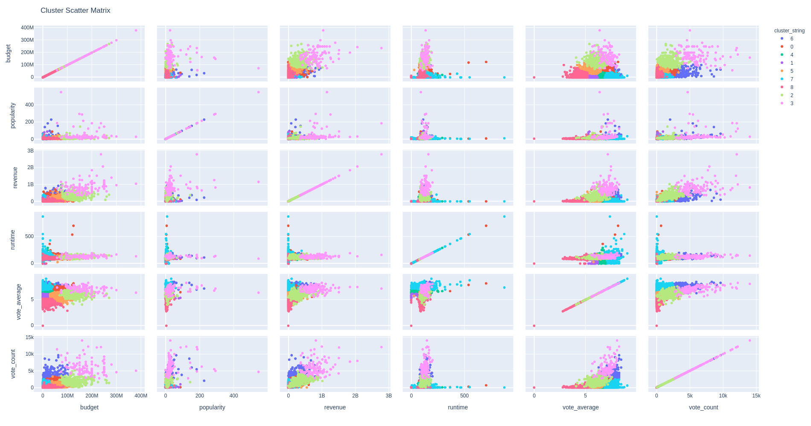
It's interesting to see that cluster 3 is always on the higher end of all values on the chart. What makes it even more interesting is that cluster 3 is the smallest of all clusters. This must mean there is a cool underlying trend for cluster 3.  

#### Each of the Clusters Genre Distribution
First thing I would like to look at is whether there is some sort of genre cluster going on (most likely not)
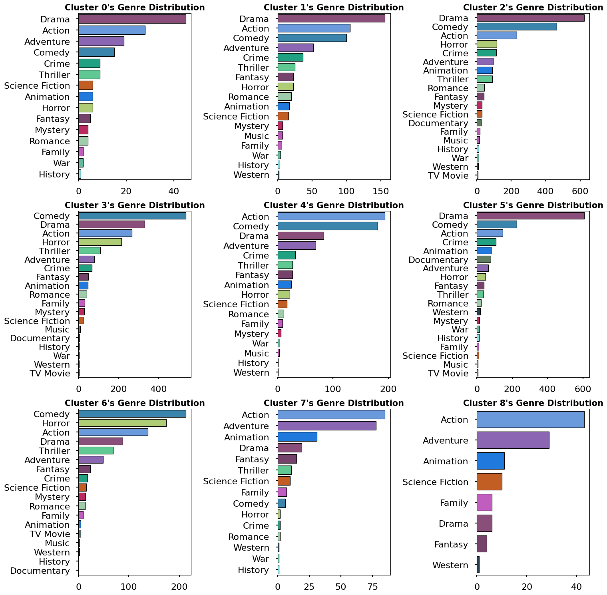
I find it interesting that Drama and Action movies seem to be the top in several clusters. This could be that there is just a larger quantity of these movies in the data set, but then why is Drama's count so low in Cluster 7 and 8?  
From these results, I'd like to next compare specific movies within the Drama and Action genres within several clusters and find the similarities / differences.

#### Drama Revenue Distribution in Clusters 0,1,2, and 5
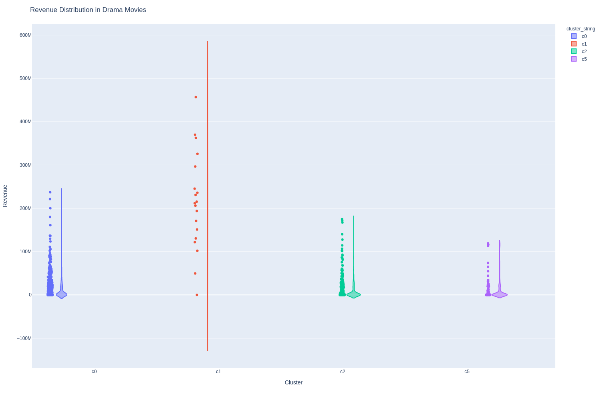

It doesn't seem like there's any special indications of why clusters are the way they are on this graph alone...but  
since plotly gives me the entire row data when I hover over a point, I was able to find out that every cluster's vote average range is usually within 1 point.  

Let's look at that hypothesis next
#### Vote Average Distribution from Drama Movies in Clusters 0,1,2, and 5
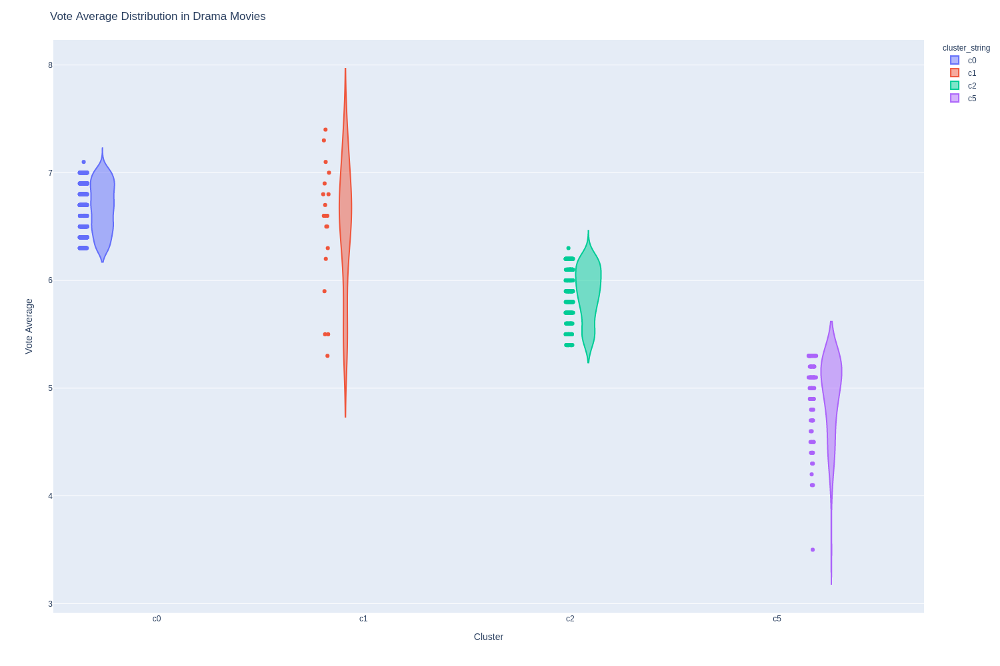 
Really interesting. It seems that my hypothesis was correct. Although this is for Drama movies within these select clusters. Let's add in all clusters.

#### Vote Average Distribution from Drama Movies in all Clusters
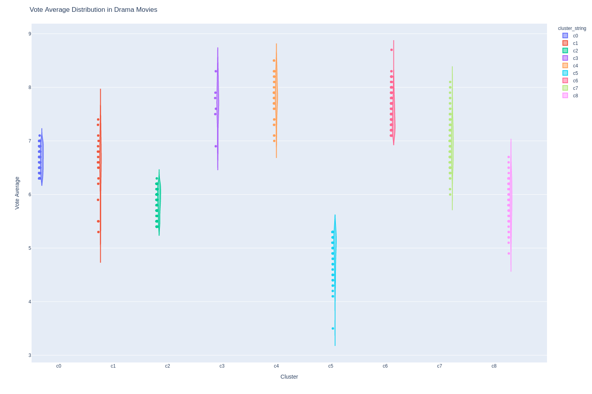
Within the drama category, vote average definitely seems to have an influence on which cluster the movie will go to. Although some clusters like 3 & 4 are hard to differentiate why one movie would be in one cluster over the other.
 
Let's see how all genres fall under this hypothesis
##### Vote Average Distribution in all Movie Genres
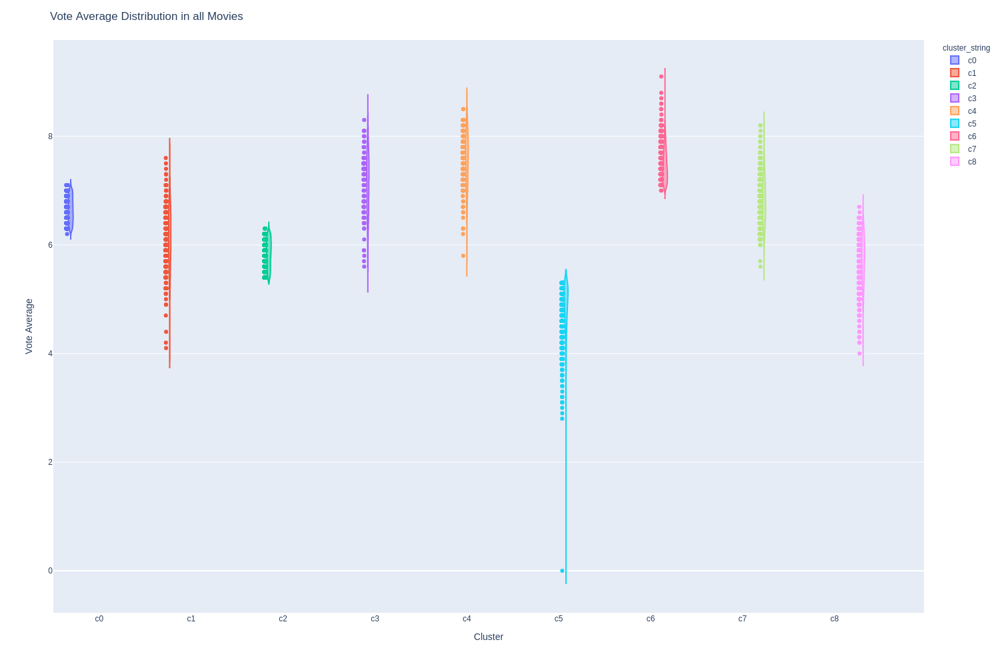
So while the clusters still have some distinction regardless of genre, the mins and maxes of the vote average increased for every cluster. This means there must be some more variables determining our clusters.

